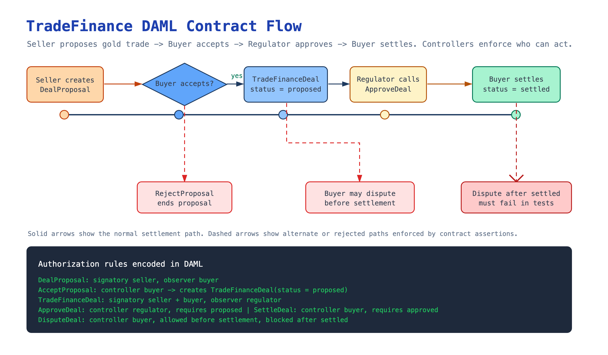

# TradeFinance

A DAML smart contract project that models a simple trade finance workflow for gold-backed transactions.

The project demonstrates how parties can propose a trade, accept it, receive regulator approval, settle the deal, and prevent invalid post-settlement disputes.

## Overview

`TradeFinance` contains three main templates:

- `GoldToken`: represents gold ownership in ounces and supports holder-controlled transfers.
- `DealProposal`: lets a seller propose a trade to a buyer.
- `TradeFinanceDeal`: tracks a buyer/seller trade through proposed, approved, settled, and disputed states.

The workflow is designed around DAML authorization:

- Sellers create deal proposals.
- Buyers accept or reject proposals.
- Regulators observe deals and approve proposed trades.
- Buyers settle approved deals or dispute unsettled deals.

## Flow Diagram



## Project Structure

```text
.
├── daml.yaml
├── daml
│   ├── TradeFinance.daml
│   └── Test.daml
├── docs
│   └── diagrams
│       ├── trade-finance-flow.excalidraw
│       ├── trade-finance-flow.png
│       └── trade-finance-flow.svg
├── .dlint.yaml
├── .gitattributes
└── .gitignore
```

## Requirements

- DAML SDK `2.10.4`

Check the installed DAML SDK versions:

```bash
daml version
```

## Build

Compile the DAML project:

```bash
daml build
```

## Test

Run the DAML Script tests:

```bash
daml test
```

The test module covers:

- A full proposal, acceptance, approval, and settlement lifecycle.
- Rejection of a dispute after settlement.
- Rejection of an unauthorized approval attempt by an outsider.

## Main Workflow

1. A seller creates a `DealProposal`.
2. The buyer accepts the proposal, creating a `TradeFinanceDeal`.
3. The regulator approves the proposed deal.
4. The buyer settles the approved deal.
5. A settled deal can no longer be disputed.

## License

No license has been specified.
